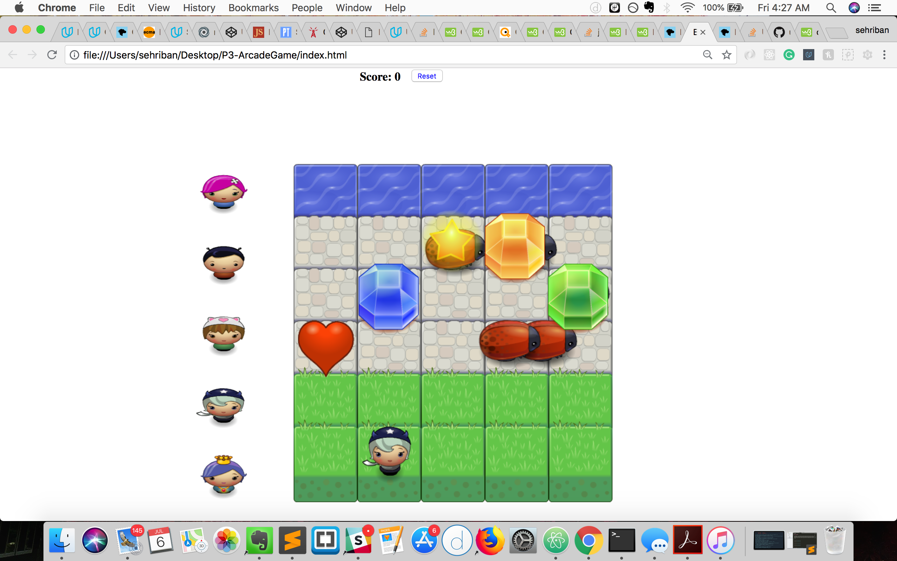
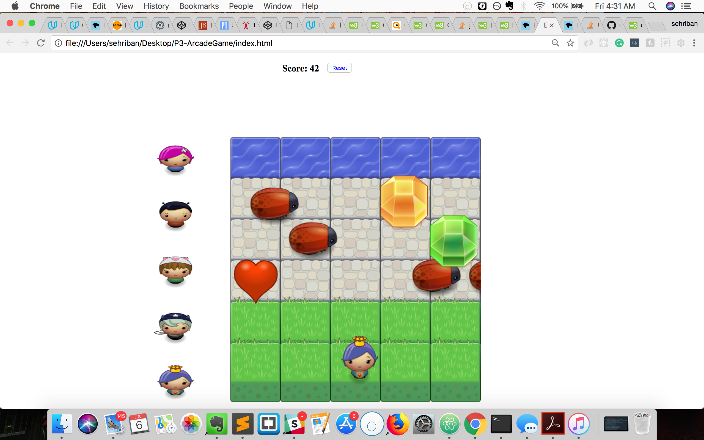
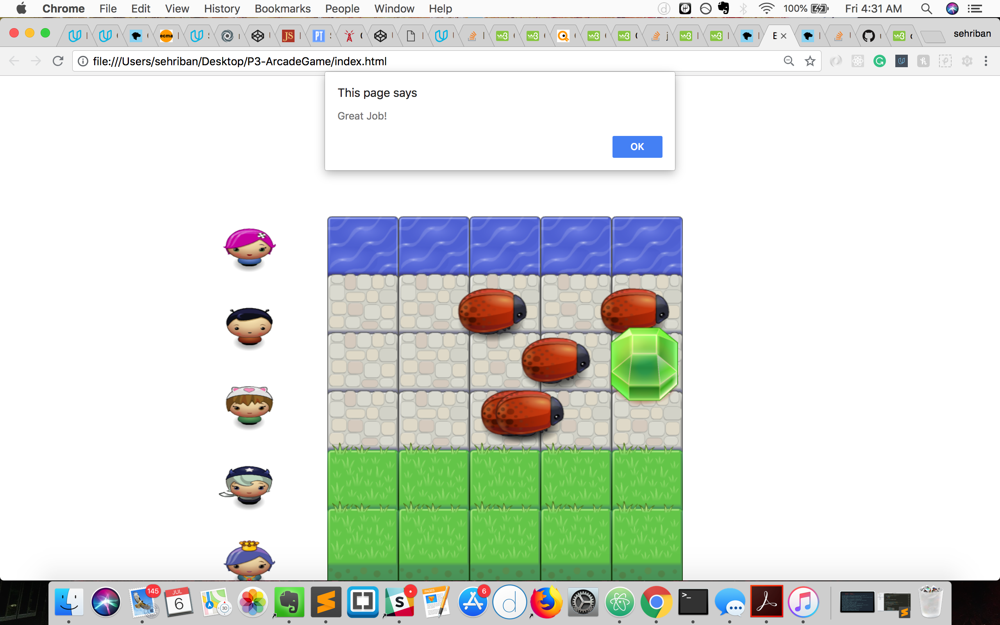

# README

Udacity- Arcade Game
===================
** To download the game  get the zipfile or clone the repository on your local machine and run index.html file on your browser. 
** Or just simply play the game! To play the game go to http://udacity-arcadegame.bitballoon.com/ You can even play on the way work on your phone!
* Use the arrow keys to move the player on the canvas. The goal is to reach to the water without getting eaten by the bugs. Get exytra points and jump to the water by reaching the gems!
* Have fun!

**Arcade Game** is a canvas game which includes running bugs from side to side while a player is trying to go all the way up from the bottom without getting eaten by this bugs. If the player get reach the gems will get an extra points and that will skip all the bugs with jumping all the way up.After getting certain points the player wins the game. After winning the game or whenever the user wants, they will be able to restart the game iether using the reset button or with winning the game.

----------

----------

----------

----------

**Sherry Cheng** - https://github.com/sgc88

----------

Technologies
-------------------
* HTML
* CSS
* javascript
* constructor functions
* setTimeout()
* getRandomInt()
* Math.floor(Math.random())
* setAttribute()
* getAttribute()
* for loop
* nested if-else statements
* addEventListener()
* target Event property
* slice()
* drawImage on canvas
* position image on canvas
* Expressions - this
* KeyboardEvent Properties

----------

Existing Features
-------------------
* User can move the player on the canvas
* The player can be moved up-donw, left-right
* If the player touches the gems gets the points and skips all the way to water
* The user need to get at least 100 points to win the game
* Once the user wins the game, it starts over.
* Once the user wins the game the player takes its first position, the gems display on the canvas and the score sets to 0.

----------

Planned Features
-------------------
* Be able to invite people via email/text to play the game.
* Be able to play with 2 players.
* Be able to have a different/ multiple boards
* Be able to play with people from different locations.

* ...
Useful Researches:
*https://www.google.com/
*https://developer.mozilla.org/en-US/docs/Web/API/Event/target
*https://stackoverflow.com
*https://developer.mozilla.org/
*https://developer.mozilla.org/en-US/docs/Web/API/Element/setAttribute
*https://classroom.udacity.com
*https://www.w3schools.com/jsref/met_document_queryselector.asp
*https://www.quackit.com/css/css_color_codes.cfm
*https://javascript.info/class-inheritance
*https://developer.mozilla.org/en-US/docs/Web/API/CanvasRenderingContext2D
*https://stackoverflow.com/questions/31457605/uncaught-typeerror-when-calling-drawimage-function
*https://stackoverflow.com/questions/1527803/generating-random-whole-numbers-in-javascript-in-a-specific-range
*https://stackoverflow.com/questions/45397154/canvas-animation-with-javascript-random-coordinates-and-speed-at-every-initiati